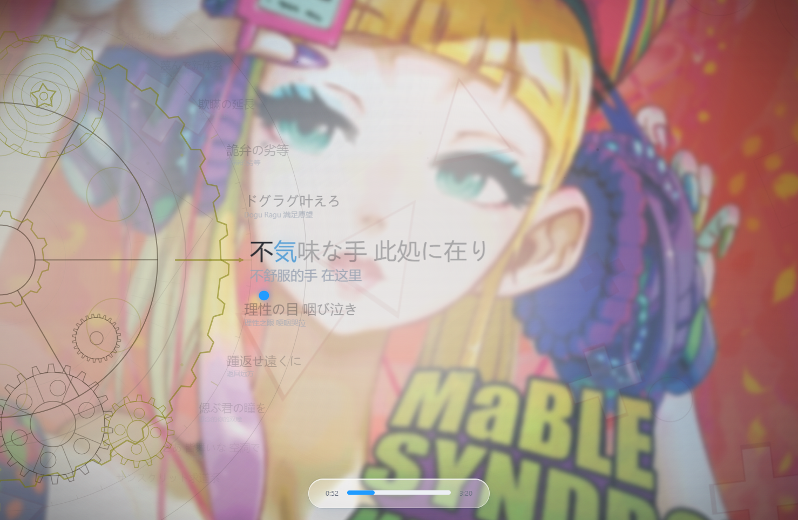
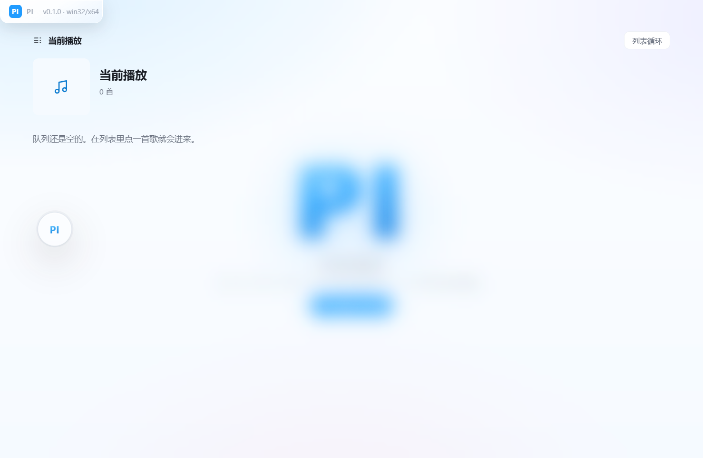
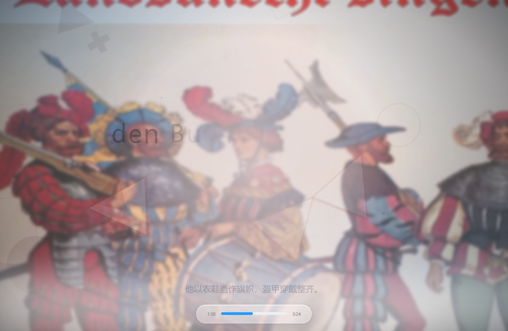
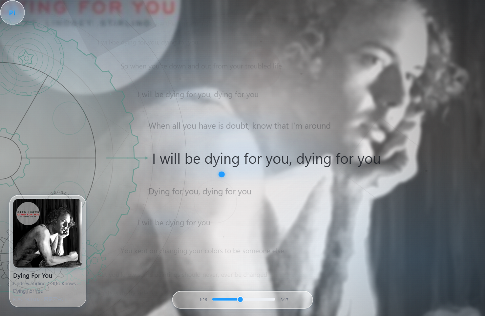
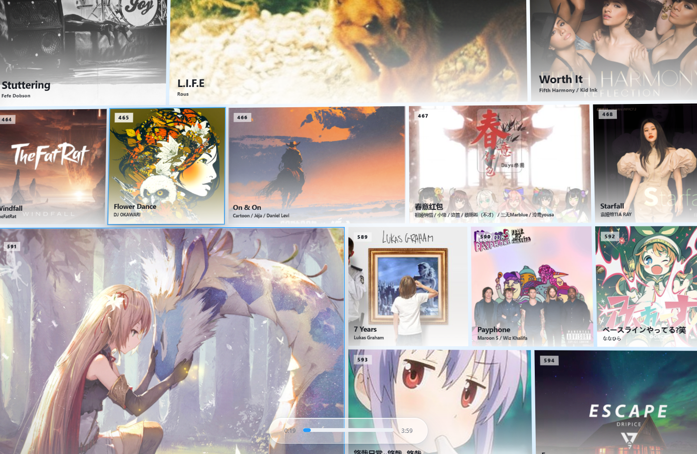
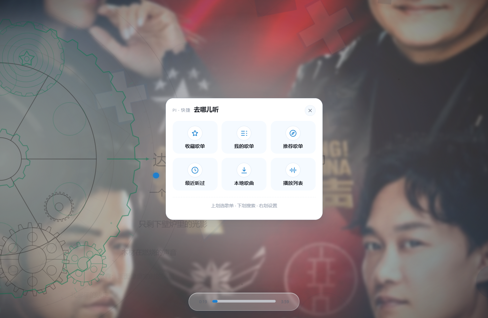
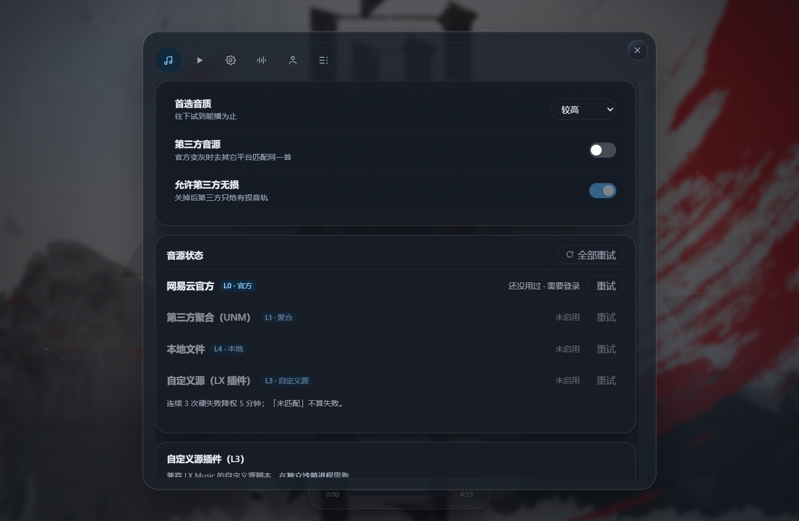
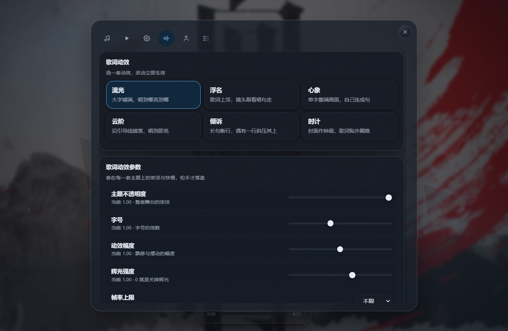

<p align="center">
  
</p>

<div align="center">

# PI

Music, Reimagined // 拾音新境

[](https://github.com/taosuuuw/PI_muisc/releases)
[](https://github.com/taosuuuw/PI_muisc/stargazers)
[](https://nodejs.org/)

[项目简介](#项目简介)
·
[主题预览](#部分歌词主题预览)
·
[核心能力](#核心能力)
·
[获取方式](#获取方式)
·
[开发文档](./docs/DEVELOPMENT.md)
·
[致谢](#致谢)

</div>

## 项目简介

PI 是一款以**全屏沉浸式歌词**和**多源音源解析**为核心的桌面音乐播放器，基于 Electron 与 React 构建，面向 Windows 桌面。

它接入网易云音乐的数据（歌曲 / 歌单 / 评论 / 登录），并在播放时按一条**四层责任链**尽可能拿到无损音源：官方接口 → 第三方聚合 → 你导入的 LX 自定义源 → 本地文件夹。每一层的实际音质都用 HTTP Range 嗅探文件头**实测**，而不是相信接口的自称。

歌词是这个项目的重心。全屏歌词页提供**六套动效主题**（流光 / 浮名 / 心象 / 云阶 / 倾诉 / 时计），每套都有独立的排版氛围与逐字动效，并暴露 **17 个可调参数**；配合按歌词情绪与封面色彩生成的**沉浸式背景**，让全屏歌词拥有接近文字 PV 的观感，同时自动适配任意窗口尺寸。

## 展示


### 部分歌词主题预览

<table>
  <tr>
    <td width="50%">
      
    </td>
    <td width="50%">
      
    </td>
  </tr>
  <tr>
    <td align="center"><strong>流光</strong> · classic</td>
    <td align="center"><strong>浮名</strong> · fume</td>
  </tr>
  <tr>
    <td width="50%">
      
    </td>
    <td width="50%">
      
    </td>
  </tr>
  <tr>
    <td align="center"><strong>心象</strong> · cadenza</td>
    <td align="center"><strong>云阶</strong> · partita</td>
  </tr>
  <tr>
    <td width="50%">
      
    </td>
    <td width="50%">
      
    </td>
  </tr>
  <tr>
    <td align="center"><strong>倾诉</strong> · tilt</td>
    <td align="center"><strong>时计</strong> · pendolo</td>
  </tr>
</table>

不同的歌词动画有不同的排版氛围和可调参数，并可随窗口尺寸自适应铺满，全屏与窗口模式下都不会溢出或裁切。

### 其它界面

<table>
  <tr>
    <td width="50%">
      
    </td>
    <td width="50%">
      
    </td>
  </tr>
  <tr>
    <td align="center"><strong>我的喜欢 · 拼贴墙</strong></td>
    <td align="center"><strong>点出 PI 键 · 六块按键卡</strong></td>
  </tr>
  <tr>
    <td width="50%">
      
    </td>
    <td width="50%">
      
    </td>
  </tr>
  <tr>
    <td align="center"><strong>设置边框页</strong></td>
    <td align="center"><strong>歌词动效参数</strong></td>
  </tr>
</table>

## 核心能力

| 模块 | 说明 |
| --- | --- |
| 在线搜索与播放 | 搜索歌曲、歌手或专辑后即可播放，自动加载封面与歌词。 |
| 四层音源解析链 | L0 官方接口 → L1 内嵌 UnblockNeteaseMusic → L3 你导入的 LX 自定义源 → L4 本地文件夹，逐层尝试，第一个「满足音质且通过字节嗅探」的结果胜出。 |
| 音质实测而非自称 | 用 HTTP `Range` 取文件头嗅探容器与采样率（`fLaC` / `ID3` / `ftyp` / `OggS`），来源自称与实测不符时明确显示「标称 X，实测只到 Y」。 |
| 全屏歌词 · 六套动效主题 | 流光 `classic` / 浮名 `fume` / 心象 `cadenza` / 云阶 `partita` / 倾诉 `tilt` / 时计 `pendolo`，各自动效与排版骨架独立。 |
| 歌词动效参数 | 17 个可调旋钮（主题透明度 / 字号比例 / 动势 / 辉光 / 帧率上限 / 每曲随机主题 / 相机跟随 / 逐字旋转 / 云阶断行 / 时计表盘 …）外加一键复位。 |
| 沉浸式情绪背景 | 用 6 族 89 条中英情绪词典给歌词打分，配合封面取色生成背景构图——**纯本地，不依赖任何联网 LLM**。 |
| 卡片化列表 | 搜索 / 歌单 / 队列 / 喜欢一律卡片流；「我的喜欢」是一面可无限拖拽的拼贴墙，支持悬停互动、点击放大填屏、拖到底自动加载下一页。 |
| 手势化操作 | 点空白处浮出 `PI` 键，**上划**六块按键卡 / **下划**搜索 / **右划**快捷设置。 |
| 音质日志与健康降权 | 记录最近 200 次解析（含每个音源的成功 / 失败 / 耗时）；连续硬失败的音源自动降权 5 分钟，设置页可见可手动重试。 |
| 账号安全红线 | 登录 cookie 只发往 `127.0.0.1` 的内嵌服务，任何第三方音源都拿不到；LX 脚本跑在无 `require` / `process` / `fs` 的独立沙箱子进程里。 |
| 本地音乐 | L4 本地文件夹兜底匹配（歌名 + 歌手 + 时长硬条件）。 |
| 打包与安装 | 便携版绿色目录 + C# 自解压安装器；按用户安装、免管理员 / UAC、全程不落地任何临时文件。 |

## 获取方式

### 直接下载

- **Windows 安装包**：最新版本请前往 [Releases 页面](https://github.com/taosuuuw/PI_muisc/releases/latest) 下载
  `PI-Setup-<版本>.exe`，双击运行即可。安装到 `%LOCALAPPDATA%\Programs\PI`，**按用户安装，不需要管理员 / UAC**，
  并会登记到「设置 → 应用 → 已安装的应用」，可从那里卸载。

静默 / 脚本化安装：

```powershell
PI-Setup-0.1.0.exe --silent --target "<安装目录>" --no-shortcuts
```

### 从源码构建

需要 Node.js `>= 22.12.0` 与 pnpm `10.x`：

```bash
pnpm install
pnpm electron:install   # 首次必须：下载 Electron 运行时（约 250MB）
pnpm dev                # 启动 Vite + Electron 开发环境
```

打包：

```bash
pnpm release            # 一条龙：build → dist → installer
pnpm dist               # 便携版 → release/pi/（绿色目录，双击 pi.exe 即跑）
pnpm installer          # 安装包 → release/PI-Setup-<版本>.exe
```

> 本仓库**不使用 npm**；所有命令都用 `pnpm`。更完整的环境要求、环境变量、
> 目录结构、架构约束与打包细节见 [开发文档](./docs/DEVELOPMENT.md)。

## 界面与操作

- **点空白处**浮出 `PI` 键，然后 **上划** 打开六块按键卡（收藏歌单 / 我的歌单 / 推荐歌单 / 最近听过 / 本地歌曲 / 当前播放），
  **下划** 打开搜索，**右划** 打开快捷设置。
- 播放页左下角是歌曲名片，**切歌时会脉冲一次**；右下是歌词轨道，滚轮只浏览歌词、**绝不改变播放进度**。
- 「我的喜欢」是一面拼贴墙：悬停有描边与扫光，点击正在播放的那一格会放大填屏回到播放页，一直往下拖会自动翻页加载。

## 现状与未完成

**照实说**，这是个还在长身体的版本：

- 「本地歌曲」入口目前是**占位**——本地源解析（L4）已经可用，但本地曲库的浏览页面尚未落地。
- 「主题颜色」只有明 / 暗 / 跟随系统，**不能换主色**（主色由专辑封面提色而来）。
- 逐字歌词时间戳尚未接入，当前按行时长均分兜底。
- 目前只提供 Windows 桌面端；没有移动端与 Web 版。
- 仓库内**没有 `LICENSE` 文件**，授权状况见下。

## 文档与开发

| 文档 | 内容 |
| --- | --- |
| [开发文档](./docs/DEVELOPMENT.md) | 环境变量、启动方式、构建与打包、目录结构、架构约束、音源体系、历轮改版记录 |
| [PLAN.md](./docs/PLAN.md) | 需求 → 架构 → 里程碑，以及全部决策过程 |
| [API-MAP.md](./docs/API-MAP.md) | 音源与接口清单 |
| [ADR/](./docs/ADR) | 架构决策记录 |
| [CREDITS.md](./docs/CREDITS.md) | **鸣谢与借鉴来源账本**——借了谁、借了什么、授权状况 |

## 法律与免责声明

本项目在 AI 的广泛协助下开发，因此仍可能存在细微或不易察觉的问题。若给你带来不便，敬请理解。

本项目主要用于展示播放动效、界面设计与相关工程实现。应用中涉及的在线音乐流媒体、歌词、专辑封面及其他内容，其版权均归对应权利人所有。

本仓库及其源代码仅供个人学习、技术交流与非营利测试使用。请勿将其用于商业盈利用途。若因对在线资源的传播、加工或再分发而引发版权纠纷或其他责任，均由使用者自行承担，项目开发者不承担相关责任。

请始终尊重数字版权，并在条件允许时通过官方平台支持正版音乐。

## 致谢

### 特别感谢

**[chthollyphile/folia-major](https://github.com/chthollyphile/folia-major)** —— PI 的界面与动效设计直接受益于这个项目。

PI 的全屏歌词页在版式骨架、逐字三态（字号 / 透明度 / 缩放 / 模糊 / 时长）、材质与阴影槽、
封面拼贴铺法，以及六套歌词主题的数值体系上，都参考并借鉴了 folia-major。
它让我们看清了「全屏歌词可以做到什么程度」。

必须说清楚的是：folia-major 采用 **AGPL-3.0**（强 copyleft）授权。PI 的做法是
**只借鉴不受版权保护的数值、参数与做法思路，代码全部自行实现，不复制其源码**；
其视觉设计与实现思路也给了我们很多启发。如果你也想参考它，请务必先读它的许可证。

以上借鉴的逐条明细、我们**采纳了什么 / 没有采纳什么**，都如实登记在 [CREDITS.md](./docs/CREDITS.md)。

### 其它致谢

folia-major 的致谢名单里点名的项目，本仓库同样登记在案：

- [chenmozhijin/LDDC](https://github.com/chenmozhijin/LDDC)
- [NeteaseCloudMusicApiEnhanced/api-enhanced](https://github.com/NeteaseCloudMusicApiEnhanced/api-enhanced)
- [chenglou/pretext](https://github.com/chenglou/pretext)
- [MakcRe/KuGouMusicApi](https://github.com/MakcRe/KuGouMusicApi)
- [paper-design/shaders](https://github.com/paper-design/shaders)
- [yakult-green-tea/qq-music-api](https://github.com/yakult-green-tea/qq-music-api)
- [amll-dev/amll-ttml-db](https://github.com/amll-dev/amll-ttml-db)
- [Widdit/now-playing-service](https://github.com/Widdit/now-playing-service)

以及音源链路上真正在干活的 [UnblockNeteaseMusic](https://github.com/UnblockNeteaseMusic/server)
与 LX Music 自定义源协议。感谢这些项目的作者与贡献者。

## 授权状况

本仓库**当前没有 `LICENSE` 文件**，即保留所有权利（All rights reserved）。
在补充许可证之前，请不要将其用于再分发或商业用途。详见 [CREDITS.md](./docs/CREDITS.md) §4。
